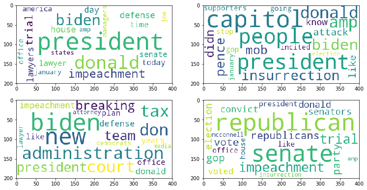
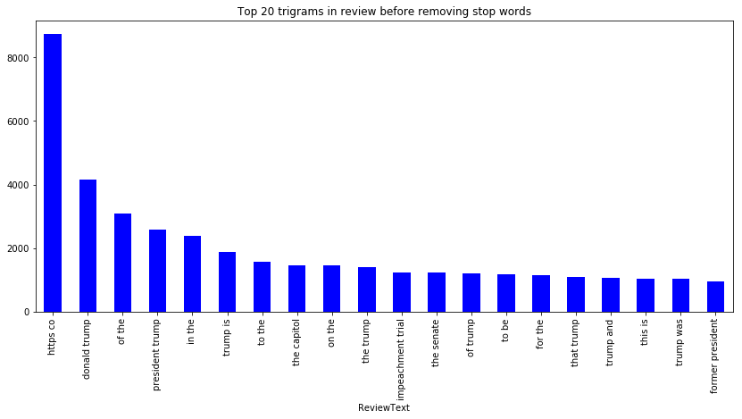
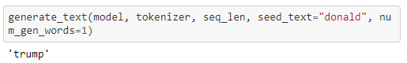

# Capstone-NLP_Word_Completion
## Introduction

Student name: Joey Husney
Student pace: full time
Scheduled project review date/time: N/A
Instructor name: Yish Lim

## Business Case
In this notebook, we will attempt to use the powerful tools given to us by NLTK, spacy, keras, and other libraries to create an application that can predict the next word in a tweet that the user wishes to type. The goal of this project isn't just to give one word to the user but a few different options ordered by the probability of each option being the desired next word. In order to achieve a high accuracy score, we will be deploying an unsupervised learning method prior to our supervised learning modeling. We will split the tweets into different categories using LDA. Only after that will we begin modeling but on each cluster individually.

## The Data
The data we will be using consists of tweets from the twint API. Information on this API be accessed here. This API contains not just tweets but loads of information about each tweet. We will likely be using just the tweet text column because the other columns won't be much use to us. The Twint API uses web scraping to retrieve this data for us to access through its API. With just a few simple steps, it can be set up without much thought. The specific data we will be accessing from twint are a list of the ten thousand most popular recent tweets. This data will be stored into a pandas data frame to be modified throughout this process.

## EDA

##  Prediction Example

## Conclusion and insights
* After using a 500 epoch neural network, we have achieved approximately a 15% accuracy score with our next word predictions.
* The initial tweet predictor gave us around an 8% accuracy score due to less iterations.
* Although 15% doesn't seem so high, based on the small amount of tweets fed into the nueral network, it it a relatively high accuracy score.

## Future work:
* Trying other models besides for nueral network models
* Figuring out a way to incorperate LDA into project (besides for visualization purposes)
